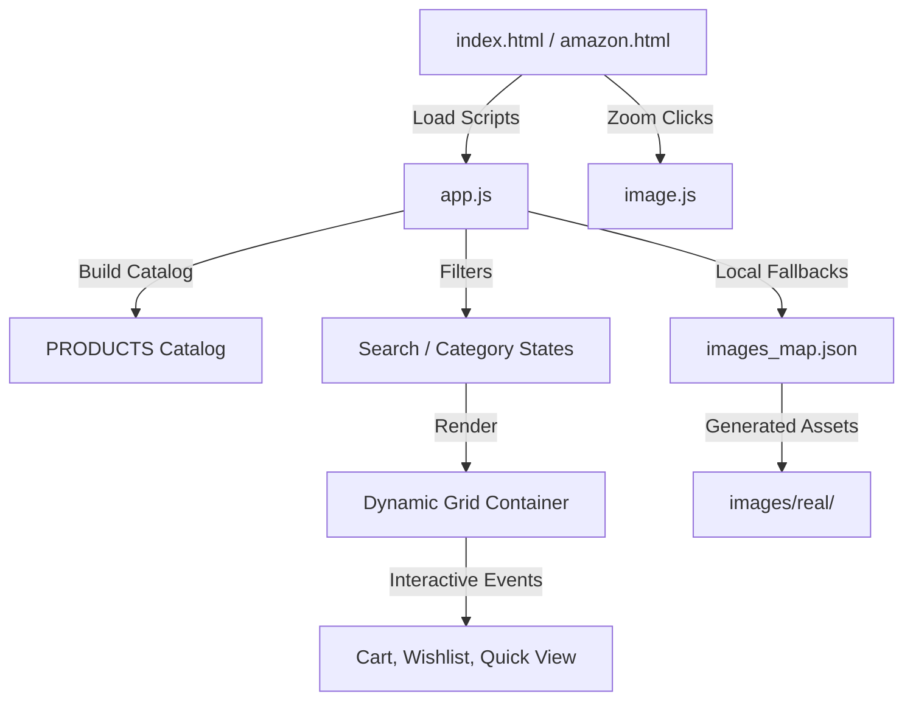
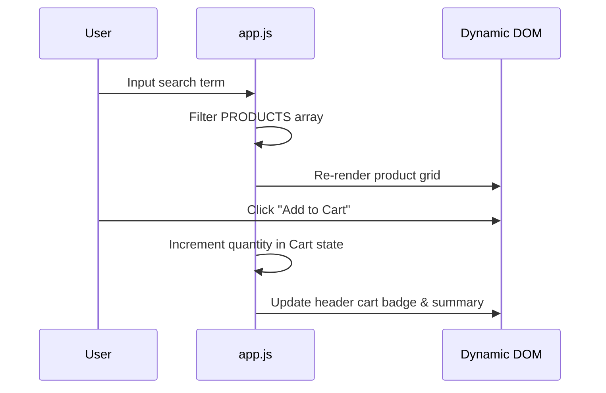

# Premium Amazon Web Clone

A fully responsive, highly interactive front-end replica of Amazon Premium built using HTML5, CSS3, and modern Vanilla JavaScript. This project runs entirely client-side, featuring a dynamic product generation catalog, dedicated feature dashboards, live search/filtering, and a offline-compatible product image pipeline..

---

## 🚀 Key Features

### 1. Dynamic Catalog Engine
* **Automatic Spec Generator**: Products are built programmatically across five categories (*Electronics, Fitness, Home & Kitchen, Fashion, Beauty*). Each item features a distinct description, calculated pricing, specific attributes, and a unique set of user reviews.
* **Badges & Tags**: Select items are styled with dynamic badges such as `Best Seller`, `Deals`, and `New Arrival`.
* **Reviews System**: Realistic simulated user reviews with randomized user profiles, custom comments, star ratings, and dates.

### 2. Interactive Shopping Experience
* **Live Search and Filter**: Instant filtering of products by title, category, or description via the top search bar, department selector, or sub-navigation bar.
* **Ergonomic Quick View Modal**: View full technical specifications and user reviews inside an interactive overlay without reloading the page.
* **Product Lightbox Zoom**: Interactively view high-resolution versions of product images inside an custom lightbox overlay with smooth zoom indicators.
* **Interactive Wishlist**: Save items locally to a wishlist with persistent toggle hearts that update across the UI.
* **Simulated Cart System**: Add items, adjust quantities, review order summaries, and proceed through a multi-step checkout pane.

### 3. Dynamic Feature Dashboards
Switch seamlessly between the main feed and custom dashboard views:
* **Today's Deals**: Lightning deals showing 15% discounts, animated stock claim progress bars, and a live countdown timer.
* **Gift Cards**: Wallet system that lets users claim codes (such as `AMZ-GIFT-50` or `AMZ-GIFT-100`) to increase their simulated wallet balance in real-time.
* **Registries Finder & Creator**: Event registry coordinator supporting wedding and baby registries.
* **Wishlist Manager**: Dedicated panel displaying saved user items.

### 4. Smart Asset Pipeline (Offline & Remote)
* **Local Fallback Maps**: Fully compatible with the `file://` protocol. If remote Unsplash URLs fail or are blocked, the app falls back to high-quality local `.png` assets.
* **Automated Map Generation**: Includes `map_real_images.js`, a Node.js script that scans the local asset folder and writes an category-grouped catalog mapping to `images_map.json`.
* **Mutation Observer**: A live DOM observer that dynamically binds image error fallbacks and click events to new cards as the page infinite-scrolls.

---

## 🛠️ Architecture & Workflow

Here is how data flows through the application:



### Event Interaction Workflow


---

## 📂 Project Structure

```
├── amazon.html             # Secondary UI layout
├── index.html              # Main entry point website
├── app.js                  # Core state, rendering, and dashboard engine
├── image.js                # Lightbox overlay zoom handler
├── styles.css              # Premium custom CSS styling
├── map_real_images.js      # Utility script to rebuild local images map
├── update_currency.js      # Utility to convert/update price structures
└── images/
    ├── images_map.json     # Generated category-to-asset mapping
    ├── product-1..12.svg   # Primary vector fallbacks
    └── real/               # High-res custom product images
```

---

## 💻 Local Setup

1. **Clone the repository**:
   ```bash
   git clone https://github.com/amanverma0001/Amazon-clone.git
   cd Amazon-clone
   ```

2. **Run locally**:
   * Open `index.html` directly in any web browser (`file://` protocol is fully supported!).
   * Alternatively, serve it using a lightweight local server (e.g., Live Server extension in VS Code).

3. **Rebuilding local image maps**:
   If you add new custom product images to `images/real/` (following the naming prefix `electronics_`, `fitness_`, etc.), run the Node.js script to update the mapping:
   ```bash
   node map_real_images.js
   ```

---

## 👥 Contributors

* **Aman Verma** ([amanverma0001](https://github.com/amanverma0001)) - Lead Developer

<!-- update_amazon 1 -->

<!-- update_amazon 2 -->

<!-- update_amazon 3 -->

<!-- update_amazon 4 -->

<!-- update_amazon 5 -->

<!-- update_amazon 6 -->

<!-- update_amazon 7 -->

<!-- update_amazon 8 -->

<!-- update_amazon 9 -->

<!-- update_amazon 10 -->

<!-- update_amazon 11 -->

<!-- update_amazon 12 -->

<!-- update_amazon 13 -->

<!-- update_amazon 14 -->

<!-- update_amazon 15 -->

<!-- update_amazon 16 -->
